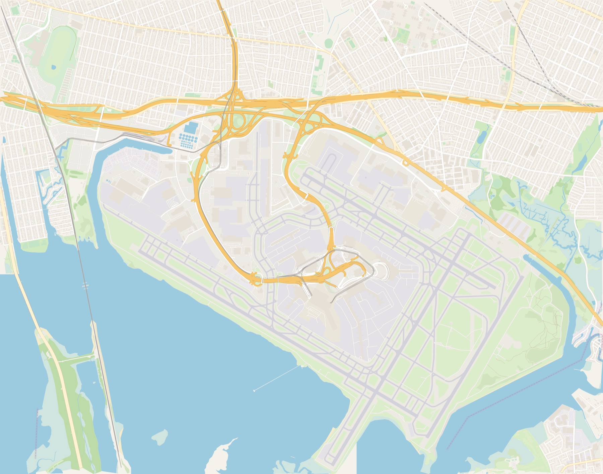

# maps

A fast, parallel OpenStreetMap renderer written in Rust. Give it an
`.osm.pbf` extract and it produces print-quality posters or a browsable XYZ
tile pyramid, entirely offline.


| Financial District in 3D, z17 | Midtown in the dark theme |
| --- | --- |
|  |  |



## Features

- **Full cartographic style**: about 70 feature kinds covering land use, land cover,
  water, a road hierarchy with casings, rail, aeroways, piers, barriers,
  power lines, ferries, administrative boundaries and individual trees. Widths
  and visibility change with zoom.
- **Oceans from coastlines.** Coastline ways are stitched into land polygons
  clipped to the extract, so the sea is actually blue.
- **Real multipolygons**: rings are assembled from relation members and holes
  are rendered correctly (courtyards, islands in lakes, lakes on islands).
- **3D buildings**: from zoom 15, buildings are extruded by their `height` /
  `building:levels` tags in an oblique view, with facades shaded by
  orientation and back-to-front painting. `--buildings flat` switches to flat
  footprints with cast shadows instead.
- **Two custom themes**: *Daylight* (warm paper, teal water, a single amber
  highway accent) and *Midnight* (ink-blue land, streets that glow warmer
  with importance), plus `--scale 2` for high-DPI output.
- **Tiles or posters**: an XYZ pyramid with a bundled Leaflet viewer, or a
  single image of any size, streamed to disk in bands so gigapixel posters fit
  in memory.
- **Seamless output**: geometry is clipped per tile and dash patterns keep their
  phase across tile edges.

## Usage

```sh
cargo build --release

# A 4096 px wide poster of the whole extract
./target/release/maps render nyc.osm.pbf -o nyc.png

# A close-up at zoom 17, dark theme, retina resolution
./target/release/maps render nyc.osm.pbf -o soho.png \
    --bbox=-74.010,40.718,-73.995,40.728 --zoom 17 --theme dark --scale 2

# A tile pyramid, then open tiles/index.html in a browser
./target/release/maps tiles nyc.osm.pbf -o tiles --min-zoom 10 --max-zoom 16

# Feature counts, bounds and tile estimates
./target/release/maps info nyc.osm.pbf
```

Extracts for any region are available from
[BBBike](https://extract.bbbike.org/) or [Geofabrik](https://download.geofabrik.de/).

## Performance

Measured on an Apple M1 Pro (10 cores), release build:

| Extract | PBF size | Features | Vertices | Ingest |
| --- | ---: | ---: | ---: | ---: |
| JFK airport | 2.3 MB | 52 k | 0.3 M | 0.04 s |
| Manhattan + Brooklyn | 16 MB | 297 k | 1.9 M | 0.2 s |
| New York metro | 184 MB | 3.5 M | 24.8 M | 3.4 s |

On the New York metro extract:

| Task | Time |
| --- | ---: |
| 4096 px poster, end to end (including ingest) | 3.7 s |
| 12000 × 9311 px (112 Mpx) poster, after ingest | 2.8 s |
| 48,249 tiles, z10–z16 | 20.5 s (≈2,350 tiles/s; 3,050/s at z16) |

The previous version of this project took 17 s end to end for a single
4096 px image of the same extract. Its parse alone took 10.9 s against 3.4 s
here, and it drew only unstyled lines and polygons in a stretched projection.

## How it works

```
.osm.pbf ─► ingest ─► map ─────────────► render ─► output
            3 passes   assemble rings     per viewport:  tiles / poster
            in parallel coastline → land   query index
                       orient, sort       batch, clip, rasterize
                       R-tree per zoom
```

**Ingest** (`src/ingest.rs`) reads the PBF in three parallel passes over its
compressed blobs, instead of holding every node in memory:
1. Relations. Find multipolygons and boundaries and the ways they use, and
   record which blobs contain ways and which contain nodes.
2. Ways. Keep renderable ways, coastlines and relation members as node ID
   lists. Node blobs are skipped without being decompressed.
3. Nodes. Resolve coordinates only for the referenced node IDs, plus tagged
   trees, by walking a cursor through a sorted ID list. Way blobs are skipped.

**Map building** (`src/map.rs`, `src/assemble.rs`) runs in parallel chunks:
- Multipolygon members are stitched into rings by matching endpoints.
- Rings are oriented by nesting depth (outers positive, holes negative). After
  that, one non-zero fill renders any polygon, and any union of polygons drawn
  as a single path, correctly.
- Coastlines are joined head to tail and clipped to the extract. The land
  polygons come from walking the boundary counter-clockwise from each exit
  point to the next entry point; this works because land is always on the
  left of a coastline.
- Geometry is stored as `f32` offsets from the extract origin in flat arenas.
- Features are pre-sorted into draw order. Each one gets a visibility zoom: its
  kind's minimum zoom, or the zoom at which it grows past one pixel, whichever
  is later.
- Features are indexed in one R-tree per visibility zoom, so a low-zoom query
  never touches millions of buildings.

**Rendering** (`src/render.rs`, `src/style.rs`) works per viewport:
- Query the index, then walk features in runs that share a draw group and
  layer. Road casings for a whole layer are drawn before any road fills, so
  junctions merge cleanly.
- Features with identical style are batched into a single path.
- Vertices are projected, simplified to a 0.3 px tolerance, and clipped with
  Sutherland–Hodgman (polygons) or Liang–Barsky (lines) before reaching the
  [tiny-skia](https://github.com/linebender/tiny-skia) rasterizer.
- 3D buildings are painted back to front, sorted by their southern edge in
  one global order, so neighbouring tiles agree. Each building is a roof
  (the footprint lifted up the screen) plus the walls swept by its
  viewer-facing edges; together they cover the footprint, so it needs no
  fill of its own. Queries extend below the viewport so towers south of a
  tile still rise into it.
- Flat-mode shadows are the footprint swept along the light direction. Only
  the quads of edges facing away from the light are needed, and they share a
  winding, so overlapping shadows union instead of stacking.

**Output** (`src/output.rs`) renders tiles on all cores. Posters are rendered
in parallel bands while a dedicated thread streams PNG encoding, so encoding
overlaps with rendering.

## Development

```sh
cargo test       # geometry, assembly, coastline and style unit tests
cargo clippy --all-targets
cargo fmt
```

## Data

Map data © [OpenStreetMap](https://www.openstreetmap.org/copyright)
contributors, available under the Open Database License.
