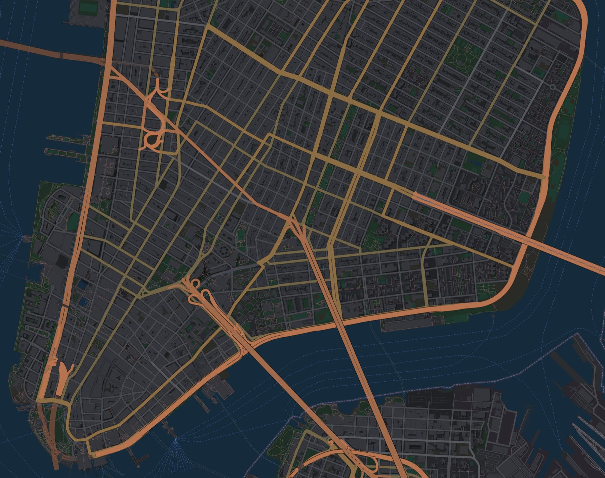
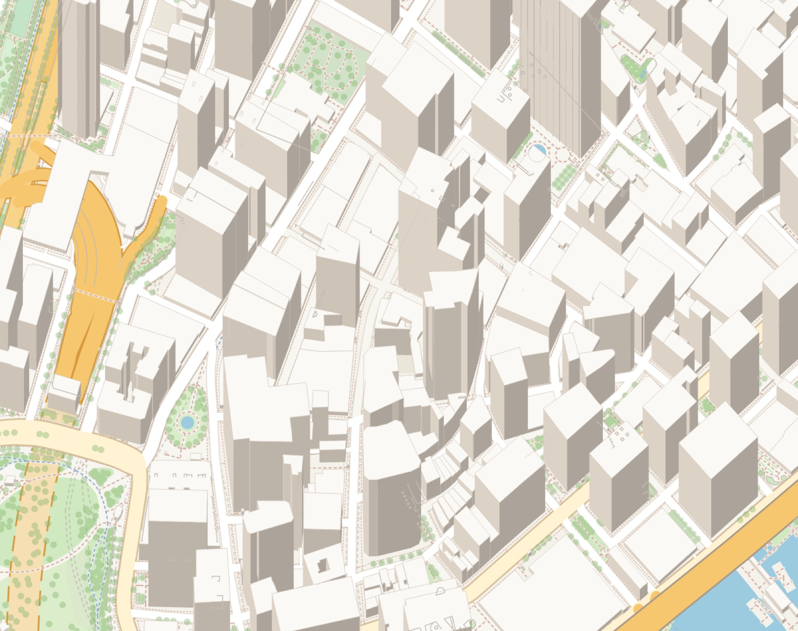
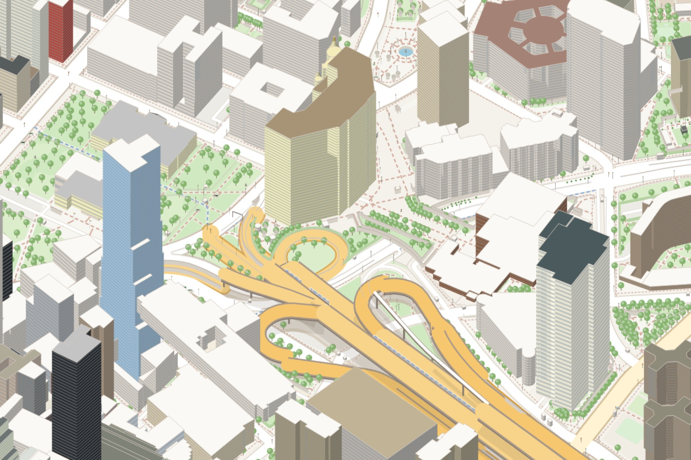
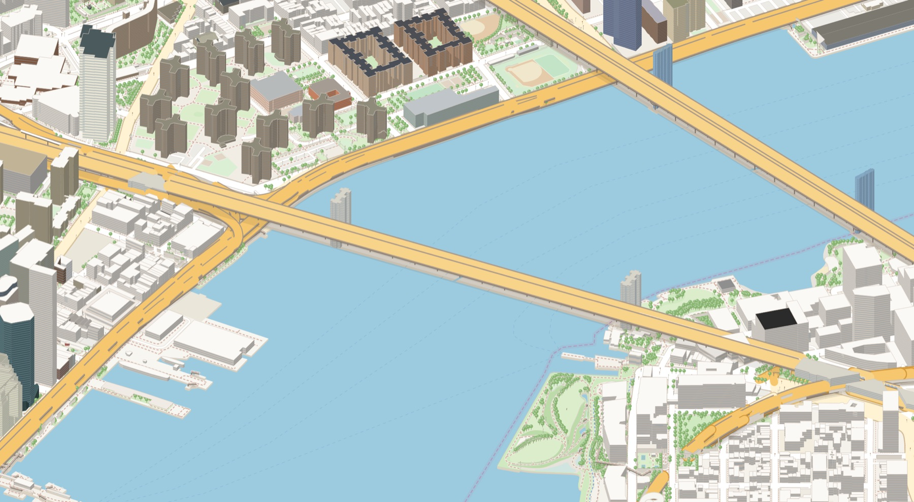
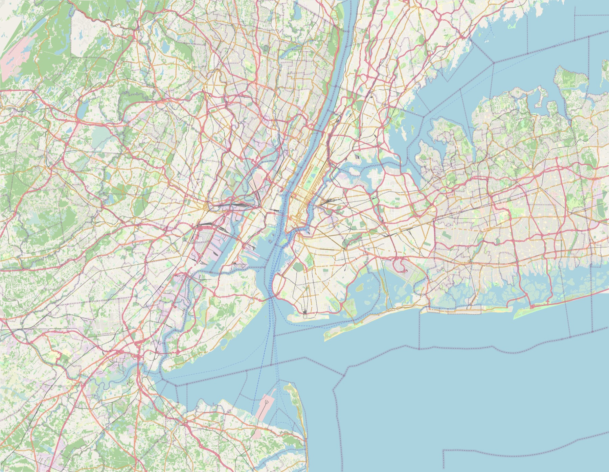

# maps

A fast OpenStreetMap renderer and real-time 3D map server written in Rust.
Load an `.osm.pbf` extract and it renders every tile on demand: rotated,
tilted and in 3D. It can also write print-quality posters or a static tile
pyramid offline.



| Financial District, z17 | Civic Center: roof shapes, mapped colours, parts |
| --- | --- |
|  |  |

| Brooklyn Bridge: decks on pillars over their shade | New York City, 184 MB extract |
| --- | --- |
|  |  |

## Features

**WebGL client, like Google Maps**
- `maps serve` keeps the map in memory and builds geometry tiles on
  request: styled, triangulated ground, road ribbons, buildings and model
  instances (`src/vtile.rs`).
- The browser draws every frame itself with WebGL2 and a perspective
  camera, so pan, zoom, rotate and tilt are smooth at 60 fps.
- Tiles load by distance (near tiles at full detail, far ones coarser) and
  fall back to parent tiles while loading.
- Material 3 controls, light and dark themes.
- The server-rendered raster viewer is still available at `/raster`.

**True 3D, painted in depth order**
- Buildings and `building:part`s rise from their mapped `min_height` to their
  `height`, so skyscraper setbacks and floating parts appear where they
  are mapped. Untagged buildings get typical heights for their type.
- Roofs follow `roof:shape`: flat, gabled, hipped, pyramidal or cone,
  skillion, dome or onion. Each roof face is shaded under one sun, and
  `roof:colour` and `building:colour` are used when mapped.
- Facades show floors as window bands. At night some windows are lit.
- Objects mapped on roofs (`location=roof`, such as New York's wooden water
  tanks) stand on their building.
- Bridges and viaducts are raised decks on pillars. Walls, hedges, fences
  and dams are vertical faces. Power lines and aerial tramways hang between
  pylons. Tree rows become rows of trees. Water lies below the land, so
  shorelines show banks.
- Everything with height is painted back to front, so a tall building in
  front hides the street, overpass or tower behind it. Tunnels are hidden
  in tilted views.

**Bespoke models for street objects**
- About 40 kinds of point objects have their own 3D model at real
  dimensions:
  - trees (with conifer variants)
  - lamps, traffic signals with three lamps, stop signs
  - power poles with crossarms, braced lattice pylons
  - flagpoles with flags, chimneys, towers
  - wooden water towers, cranes
  - hydrants, benches, picnic tables, post boxes, bike racks
  - bus shelters, phone booths, subway entrances with globe lamps
  - swing sets, monuments, buffer stops, and more

**Full cartography**
- About 140 feature kinds, chosen from a census of every tag in the NYC
  extract (`examples/census.rs`). Only physical things are drawn; names,
  addresses and routes are not.
- Golf courses, sport pitches by sport, swimming pools, parking stalls,
  road-surface areas, piers, platforms and aprons are all covered.
- Coastlines become land polygons, multipolygons keep their holes, and road
  casings merge cleanly at junctions.
- Two themes: *Daylight* and *Midnight*.

## Usage

```sh
cargo build --release

# Real-time server and viewer: open http://localhost:8080
./target/release/maps serve nyc.osm.pbf --addr 0.0.0.0:8080 --cache-mb 1024

# A poster: 45° tilt by default, any bearing, any region
./target/release/maps render nyc.osm.pbf -o fidi.png \
    --bbox=-74.017,40.702,-74.006,40.710 --zoom 17 --pitch 50 --bearing 29 --scale 2

# Straight down, the whole extract, dark theme
./target/release/maps render nyc.osm.pbf -o nyc.png --pitch 0 --theme dark

# A static tile pyramid (oblique 3D, Web Mercator aligned) with a Leaflet viewer
./target/release/maps tiles nyc.osm.pbf -o tiles --min-zoom 10 --max-zoom 17 --scale 2

# Feature counts and bounds
./target/release/maps info nyc.osm.pbf
```

In the viewer, drag to pan and scroll to zoom. Right-drag or Ctrl+drag
rotates and tilts; Shift+drag tilts. On touch screens, pinch to zoom, twist to rotate and
swipe two fingers vertically to tilt. The URL hash
(`#zoom/lat/lon/bearing/pitch`) is shareable.

Extracts for any region are available from
[BBBike](https://extract.bbbike.org/) or [Geofabrik](https://download.geofabrik.de/).

## Deployment

The binary is self-contained, pure Rust, and has no system dependencies
beyond libc. A multi-stage Dockerfile builds a 53 MB distroless image that
runs as non-root:

```sh
docker build -t maps .
docker run -p 8080:8080 -v $PWD/nyc.osm.pbf:/data/map.osm.pbf:ro maps
# or: MAP=./nyc.osm.pbf docker compose up --build
```

Endpoints:

| Path | Purpose |
| --- | --- |
| `/` | WebGL viewer |
| `/raster` | Raster viewer (server-rendered tiles) |
| `/meta.json` | Bounds, styles, data version |
| `/geo/{version}/{theme}/{z}/{x}/{y}.bin` | Geometry tiles (gzip) |
| `/models/{version}/{theme}.bin` | Model templates for instances |
| `/tiles/{version}/{style}/{bearing}/{pitch}/{z}/{x}/{y}[@2x].png` | Tiles. Immutable and cacheable forever, because `version` changes with the data. |
| `/health` | Liveness probe (`ok`) |
| `/metrics` | Prometheus counters: requests, cache hits, renders, render time, cache size |

The server shuts down gracefully on SIGTERM.

## Performance

Measured on an Apple M1 Pro (10 cores), release build.

| Extract | PBF | Features | Load |
| --- | ---: | ---: | ---: |
| JFK airport | 2.3 MB | 59 k | 0.12 s |
| Manhattan + Brooklyn | 16 MB | 361 k | 0.34 s |
| New York metro | 184 MB | 3.9 M | 4.5 s, then 1.7 GB resident |

Serving the NYC extract (Midtown, 512 px retina tiles at bearing 29° and
pitch 45°, 16 concurrent clients):

| | Average latency | Max |
| --- | ---: | ---: |
| Uncached tile (rendered on demand, about 16 ms CPU) | 18 ms | 99 ms |
| Cached tile | 0.5 ms | 3 ms |

A tilted 8000 px poster of the whole metro area renders in about 3 s after loading.
The previous version of this project took 17 s for a single unstyled 4096 px
image.

## How it works

```
.osm.pbf ─► ingest ─► map ─────────────────► render ─► server / tiles / poster
            3 passes   rings, coastlines,      ground layers, then a
            in parallel parts, roofs placed,   depth-sorted 3D scene
                       R-tree per zoom
```

**Ingest** (`src/ingest.rs`) reads the PBF in three parallel passes over its
compressed blobs:
1. Relations.
2. Ways, skipping node blobs undecompressed.
3. Only the referenced nodes, plus tagged objects, skipping way blobs.

It classifies tags into physical kinds with real or typical dimensions
(`src/classify.rs`).

**Map building** (`src/map.rs`, `src/assemble.rs`):
- Assembles multipolygon rings and orients them for non-zero filling.
- Turns coastlines into land.
- Drops building outlines that are drawn through their parts, and lifts
  rooftop objects onto their buildings.
- Sorts features into draw order and indexes them in one R-tree per zoom
  bucket.

**Rendering** (`src/render/`) uses an orthographic camera with bearing and
pitch. The ground is foreshortened by cos(pitch) and heights rise by
sin(pitch); because that map is affine, any rotated, tilted view is still a
regular tile grid.
- Ground layers are projected, simplified, clipped and rasterized with
  tiny-skia.
- Everything with height goes into a scene (`scene.rs`) and is painted back
  to front. That includes solids with real roof geometry (`solids.rs`),
  bespoke object models (`models.rs`, on a small 3D mesh rasterizer in
  `mesh.rs`) and raised line chunks (`lines.rs`).
- The paint order is a pure function of geometry and camera, so tiles agree
  at their edges.

**Geometry tiles** (`src/vtile.rs`) reuse the same styling and 3D models
but emit vertex buffers instead of pixels: earcut fills, mitered line
ribbons with per-vertex height, building meshes with roofs, and instances
of shared model templates. Detail drops with zoom (solids from z15, street
objects from z16).

**Serving** (`src/server.rs`):
- Tokio and axum handle HTTP; rendering runs on the rayon CPU pool.
- A size-bounded moka cache coalesces concurrent requests for the same tile.
- Renders whose clients have gone are skipped, and a semaphore bounds
  in-flight work.
- Render buffers are reused per thread.

## Development

```sh
cargo test
cargo clippy --all-targets -- -D warnings
cargo fmt
cargo run --release --example census -- nyc.osm.pbf   # tag census of an extract
```

## Data

Map data © [OpenStreetMap](https://www.openstreetmap.org/copyright)
contributors, available under the Open Database License.
